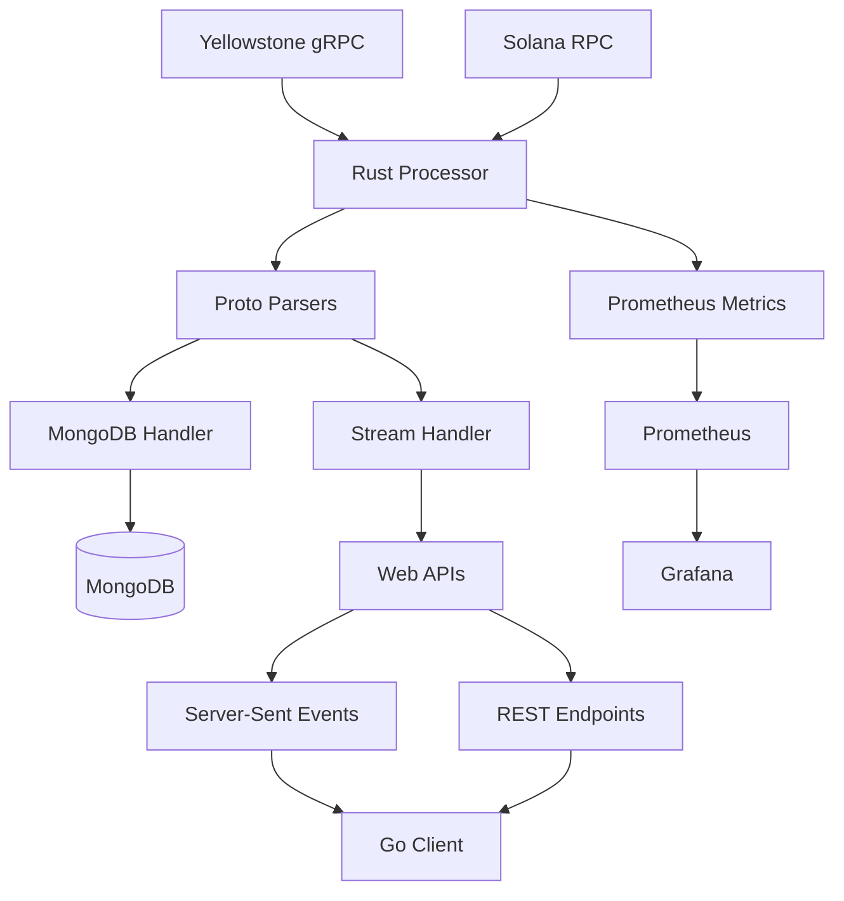

# Solana Stream Processor

Production-ready Rust application for real-time processing of high-volume gRPC messages from Solana blockchain data sources. This implementation follows the PRD requirements and provides a complete solution for parsing, filtering, and storing data from multiple DEX and token programs.

## Features

- **Real-time gRPC streaming** from Yellowstone and Solana RPC sources
- **Multi-program parsing** using existing Yellowstone Vixen proto definitions
- **MongoDB storage** with program-specific collections and optimized indexing
- **Web APIs** for data access and real-time Server-Sent Events streaming
- **Prometheus metrics** for monitoring and observability
- **Go client boilerplate** for consuming streamed data
- **Docker Compose** setup for local development with monitoring stack

## Supported Programs

The application supports parsing data from 9+ Solana programs:

| Program | Program ID | Description |
|---------|------------|-------------|
| SPL Token Program | `TokenzQdBNbLqP5VEhdkAS6EPFLC1PHnBqCXEpPxuEb` | Standard SPL token operations |
| Pump.fun | `6EF8rrecthR5Dkzon8Nwu78hRvfCKubJ14M5uBEwF6P` | Pump.fun token launching and trading |
| Pump.fun AMM | `39azUYFWPz3VHgKCf3VChUwbpURdCHRxjWVowf5jUJjg` | Pump.fun automated market maker |
| Raydium Launchpad | `6bFQpPjNLsG8xRSPJ1KJSYwE7vfzC8hPxWVNozEqYLR` | Raydium token launchpad |
| Raydium AMM V4 | `675kPX9MHTjS2zt1qfr1NYHuzeLXfQM9H24wFSUt1Mp8` | Raydium liquidity pools |
| Boop.fun | `BaUEhvUqKhw8eZ1Zb93rjE5Lxj5n1jv2brT8cEa4Y9M` | Boop.fun platform |
| Moonshot | `MoonCVVNZFSYkqNXP6bxHLPL6QQJiMagDL3qcqUQTrG` | Moonshot trading platform |
| Meteora DLMM | `LBUZKhRxPF3XUpBCjp4YzTKgLccjZhTSDM9YuVaPwxo` | Meteora Dynamic Liquidity Market Maker |
| Meteora DAMM v2 | `Eo7WjKq67rjJQSZxS6z3YkapzY3eMj6Xy8X5EQVn5UaB` | Meteora Dynamic AMM v2 |

## Architecture



## Quick Start

### Prerequisites

- Rust 1.70+
- Go 1.21+
- MongoDB 6.0+
- Docker & Docker Compose
- Yellowstone gRPC access token

### 1. Configure the Application

Copy and edit the configuration file:

```bash
cd solana-stream-processor
cp config.toml config.local.toml
```

Edit `config.local.toml` and add your Yellowstone token:

```toml
[source.grpc]
endpoint = "https://index.rpcpool.com"
x-token = "YOUR_YELLOWSTONE_TOKEN_HERE"
```

### 2. Start MongoDB and Monitoring Stack

```bash
docker-compose up -d
```

This starts:
- MongoDB on port 27017
- Prometheus on port 9090
- Grafana on port 3000
- Mongo Express on port 8081

### 3. Build and Run the Stream Processor

```bash
cargo build --release
./target/release/solana-stream-processor -c config.local.toml
```

### 4. Test the APIs

```bash
# Health check
curl http://localhost:8080/health

# Get supported programs
curl http://localhost:8080/programs

# Get recent trading data
curl "http://localhost:8080/events/recent?program=pump_fun&limit=10"

# Stream real-time data (Server-Sent Events)
curl -N http://localhost:8080/events/stream
```

### 5. Use the Go Client

```bash
cd go-client
go mod tidy
go run cmd/client/main.go -config client.yaml
```

## Configuration

### Rust Application (config.toml)

The main configuration file supports:

- **Data Sources**: Yellowstone gRPC and Solana RPC configuration
- **MongoDB**: Connection settings, indexing, and pool configuration
- **Web Server**: API endpoints, CORS, and rate limiting
- **Processing**: Buffer sizes, worker threads, and batch processing
- **Metrics**: Prometheus endpoint configuration
- **Filters**: Trading instruction filtering and program selection

### Go Client (client.yaml)

The Go client configuration includes:

- **Server**: Connection settings and retry logic
- **Processing**: Buffer sizes and worker configuration
- **Logging**: Log levels and formatting
- **Filters**: Data filtering and program selection

## API Endpoints

### REST Endpoints

- `GET /health` - Health check and system status
- `GET /programs` - List supported programs
- `GET /events/recent` - Query recent data with filters
- `GET /events/range/{program}/{collection}` - Query data by slot range
- `GET /metrics` - Prometheus metrics endpoint

### Server-Sent Events

- `GET /events/stream` - Real-time data stream

### Query Parameters

**Recent Data (`/events/recent`)**:
- `program` - Program name (e.g., "pump_fun")
- `token_mint` - Filter by token mint address
- `limit` - Maximum number of records (default: 100, max: 1000)
- `collection_type` - "accounts" or "instructions"

**Slot Range (`/events/range/{program}/{collection}`)**:
- `min_slot` - Minimum slot number
- `max_slot` - Maximum slot number
- `limit` - Maximum number of records (default: 1000, max: 10000)

## Database Schema

### Collections

For each program, two collections are created:

- `{program}_accounts` - Account data from the program
- `{program}_instructions` - Transaction instructions

### Indexes

Automatic indexes are created for:

- `slot` - For chronological queries
- `ingested_at` - For time-based queries
- `token_mints` - For token-specific queries (instructions only)
- `is_trading` - For trading instruction filtering
- `account_pubkey` - For account lookups (accounts only)
- `signature` - For transaction lookups (instructions only)

## Monitoring

### Prometheus Metrics

The application exposes metrics at `/metrics`:

- `stream_messages_processed_total` - Total messages processed
- `stream_messages_errors_total` - Processing errors
- `stream_connections_active` - Active SSE connections
- `grpc_connection_status` - gRPC connection status
- `database_operations_total` - Database operation counts
- `api_requests_total` - API request counts

### Grafana Dashboards

Access Grafana at http://localhost:3000 (admin/admin) for:

- Real-time throughput monitoring
- Error rate tracking
- Database performance metrics
- API response times

## Development

### Building

```bash
# Debug build
cargo build

# Release build
cargo build --release

# Run tests
cargo test

# Check code formatting
cargo fmt --check

# Run linter
cargo clippy
```

### Adding New Programs

1. Add the program parser crate to `Cargo.toml`
2. Update `ProgramMetadata::all_programs()` in `models/parsed_data.rs`
3. Add parsing logic in `parsers/proto_parsers.rs`
4. Update configuration examples

### Environment Variables

Key environment variables:

- `RUST_LOG` - Logging level (debug, info, warn, error)
- `MONGODB_URI` - MongoDB connection string
- `YELLOWSTONE_TOKEN` - Yellowstone gRPC token
- `BIND_ADDRESS` - Server bind address (default: 127.0.0.1:8080)

## Performance

### Benchmarks

On Mac Intel i7 with 16GB RAM:

- **Throughput**: 5000+ messages/second
- **Latency**: <50ms for streaming, <200ms end-to-end
- **Memory**: <2GB RAM under normal load
- **Storage**: Efficient MongoDB usage with batched inserts

### Optimization

- Use `--release` builds for production
- Tune `batch_size` and `batch_timeout_ms` for your workload
- Adjust `worker_threads` based on CPU cores
- Monitor MongoDB performance and add indexes as needed

## Troubleshooting

### Common Issues

1. **gRPC Connection Fails**
   - Check Yellowstone token validity
   - Verify network connectivity
   - Check firewall settings

2. **High Memory Usage**
   - Reduce `buffer_size` and `batch_size`
   - Check for memory leaks in parsing logic
   - Monitor MongoDB connection pool

3. **Slow API Responses**
   - Add appropriate database indexes
   - Reduce query result limits
   - Check MongoDB performance

### Logs

Enable debug logging:

```bash
RUST_LOG=debug ./target/release/solana-stream-processor
```

## License

MIT License - see LICENSE file for details.

## Contributing

1. Fork the repository
2. Create a feature branch
3. Add tests for new functionality
4. Ensure all tests pass
5. Submit a pull request

## Support

For issues and questions:

- Create an issue in the repository
- Check existing documentation
- Review logs for error details